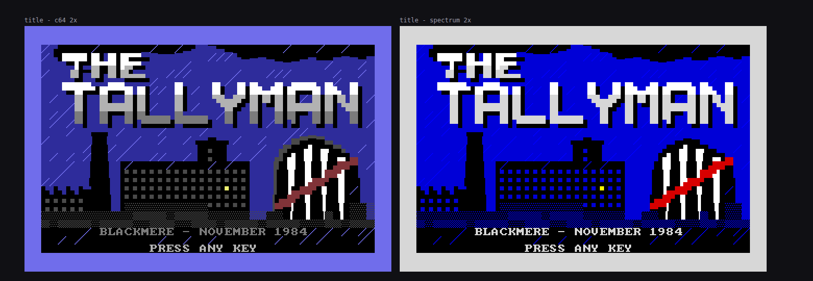
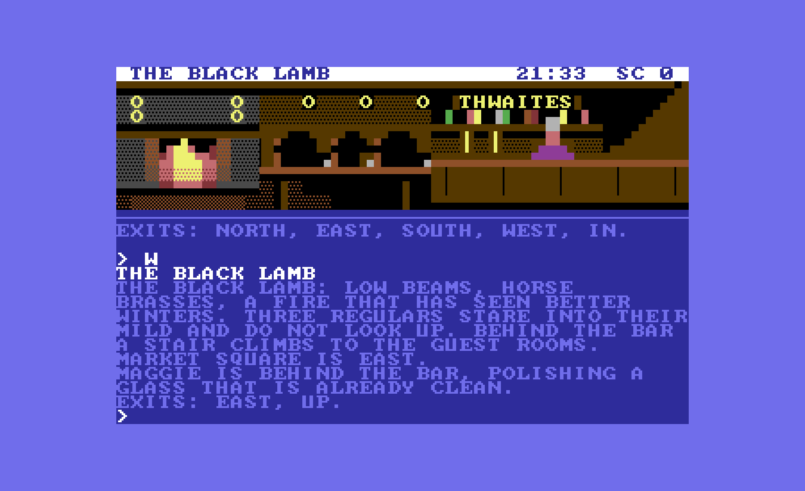

# THE TALLYMAN

*A crime thriller in text, Blackmere, November 1984.*

<div align="center">

## [▶ PLAY IN YOUR BROWSER](https://nmirkov.github.io/the-tallyman/)

No install. To play offline, download **`tallyman.html`** from the
[latest release](https://github.com/nmirkov/the-tallyman/releases/latest) and double-click it.

</div>

> [!CAUTION]
> ## Play first, read later
> **This README is spoiler-free. Almost nothing else in this repository is.**
> The story bible, the plan, the tests, the tickets and the build paper name the killer
> and spell out the solution. The worst offenders carry a big **⛔ SPOILERS ⛔** banner at the
> top. See the [reading guide](#reading-guide) below.



Four people have been found dead in four weeks in a fog-bound Lancashire mill town, each
with a tally scratched on the wall beside them. Your partner radioed in from the moor road:
*"I know who it is."* Then nothing. You have until midnight.

The Tallyman is a text adventure in the style of the Commodore 64 and ZX Spectrum games of
1982–87. It runs in the browser on a 40×25 character screen with an 8×8 bitmap font,
PETSCII-style pictures for every location, SID-style chiptune sound and a tape-loading boot
sequence. It has a two-word-plus parser, a case notebook, an accusation mechanic, a nerve
meter, eight endings and 100 points.



## Play

**Quickest way:** build once, then open the single file by double-clicking it. It works
offline and needs no server.

```bash
npm install
npm run build          # -> dist/tallyman.html (one self-contained file)
```

At the C64 power-on screen, press any key to "press PLAY on tape". That key press also
switches the sound on, since browsers only allow audio after one. Any key skips the loading.

| Key | Does |
|---|---|
| Enter | send command |
| ↑ / ↓ | command history |
| PgUp / PgDn | scroll back through earlier text |
| any key at **[MORE]** | next page |
| F2 | sound on/off |

### Commands

Short commands work best: `N`, `S`, `E`, `W`, `U`, `D`, `IN`, `OUT`, `LOOK` (`L`),
`EXAMINE` (`X`), `TAKE`, `DROP`, `SEARCH`, `READ`, `OPEN`, `UNLOCK … WITH …`,
`PUT … IN …`, `TURN ON …`, `TALK TO …`, `ASK … ABOUT …`, `SHOW … TO …`, `GIVE … TO …`,
`BUY …`, `ACCUSE …`, `ARREST …`, `INVENTORY` (`I`), `WAIT` (`Z`), `AGAIN` (`G`).
You can chain commands: `TAKE TORCH. W THEN SEARCH`.

Case and meta commands: `NOTES` (case notebook), `TIME`, `SCORE`, `HINT` (costs 2 points),
`HELP`, `UNDO`, `SAVE 1-3`, `LOAD 1-3`, `EXPORT` / `IMPORT` (save to and load from a file,
which also works when the browser blocks storage), `RESTART`, `QUIT`.

Presentation: `THEME C64 | SPECTRUM | AMBER`, `GRAPHICS ON|OFF`, `SOUND ON|OFF`,
`MUSIC ON|OFF`, `TYPEWRITER ON|OFF`, `VERBOSE` / `BRIEF`.

Each command takes thirty seconds of game time. Midnight comes at turn 300.

### Terminal version

The same engine and content also run as plain text in a terminal:

```bash
npm run play                         # interactive
npm run play -- --script moves.txt   # one command per line
```

## Development

```bash
npm start              # dev server: http://localhost:8064/src/index.html (unbundled ES modules)
npm run check          # strict content lint + ~1900 tests + build
npm run smoke          # release build driven in headless Chrome over file:// (playwright-core)
npm run audio:audit    # renders every sound offline and checks level, pitch and length
npm run progress       # regenerates docs/progress.html
```

URL parameters for testing: `?boot=off` (straight into the game), `?skipboot=1`,
`?theme=spectrum`, `?seed=n`, `?script=cmd|cmd|…`, `?storage=off`.
To audition the sound, open `tools/audio-demo.html` through `npm start`. To see every
picture, open `docs/art-preview.html`.

```
src/engine/    pure, deterministic engine: parser, resolver, world, actions, daemons
src/content/   the story as data: rooms, items, NPCs, topics, case, endings, hints, art
src/ui/        canvas screen, terminal, boot, audio (WebAudio SID-like synth), host wiring
tools/         build, dev server, terminal player, content linter, smoke, previews
tests/         unit, content, walkthrough/solvability/save-determinism, fuzz
docs/          plan, architecture contract, story bible, decisions, reviews, reports
tickets/       one folder per ticket (spec + implementation notes)
```

## How it was built

The Tallyman was built autonomously by a team of AI agents from a single instruction, with
no human in the loop:

- **The paper:** [`docs/how-we-built-it.pdf`](docs/how-we-built-it.pdf) tells the whole story of the night: the prompt, the process, the numbers, the mistakes and the lessons (⛔ spoilers).
- **Plan:** [`docs/PLAN.md`](docs/PLAN.md), reviewed by OpenAI Codex until approved (3 rounds).
- **Engine contract:** [`docs/ARCHITECTURE.md`](docs/ARCHITECTURE.md).
- **Story bible:** [`docs/STORY.md`](docs/STORY.md). It contains spoilers.
- **Tickets:** in [`tickets/`](tickets/), each built by a role agent defined in
  [`.claude/agents/`](.claude/agents/) (engine-dev, ui-dev, audio-dev, writer, artist, qa).
  The orchestrator verified every ticket in a clean worktree before committing it.
- **Milestone reviews:** recorded in [`docs/REVIEWS.md`](docs/REVIEWS.md). These were
  cross-vendor (Codex) until Codex ran out of credits. After that an independent Claude
  reviewer took over; see [`docs/DECISIONS.md`](docs/DECISIONS.md), D-009.
- **QA:** the solvability suites found four softlocks, all fixed. Blind AI playtesters with
  no access to the code played the game; see
  [`docs/PLAYTEST-REPORT.md`](docs/PLAYTEST-REPORT.md).
- **Progress:** [`docs/progress.html`](docs/progress.html).

## Reading guide

| Safe before playing | ⛔ Spoilers: read after playing |
|---|---|
| This README | [`docs/how-we-built-it.pdf`](docs/how-we-built-it.pdf), the paper on how the game was built overnight |
| [`docs/progress.html`](docs/progress.html), the build dashboard (ticket titles only) | [`docs/STORY.md`](docs/STORY.md), the full story bible and walkthrough |
| [`docs/art-preview.html`](docs/art-preview.html), every picture | [`docs/PLAN.md`](docs/PLAN.md), [`docs/ARCHITECTURE.md`](docs/ARCHITECTURE.md), [`docs/DECISIONS.md`](docs/DECISIONS.md) |
| `tools/audio-demo.html`, every sound and tune (via `npm start`) | [`docs/REVIEWS.md`](docs/REVIEWS.md), [`docs/QA-REPORT.md`](docs/QA-REPORT.md), [`docs/PLAYTEST-REPORT.md`](docs/PLAYTEST-REPORT.md), `docs/playtest/` |
| | `tickets/`, `tests/`, `src/content/`: the solution in code form |

## Licence

- **Code** (`src/engine`, `src/ui`, `tools`, `tests`): [MIT](LICENSE).
- **Story, text, pictures, music and sound data** (`src/content`, `src/ui/audio/tunes.js`, `docs/`):
  [CC BY 4.0](LICENSE-CONTENT.md). Share and adapt freely; credit "The Tallyman by Nenad Mirkov".
- **font8x8** by Daniel Hepper: public domain.

## Credits

- Font: **font8x8** by Daniel Hepper (public domain), with a hand-drawn £ glyph added.
- Everything else (code, story, pictures, music and sound) was written for this project.
